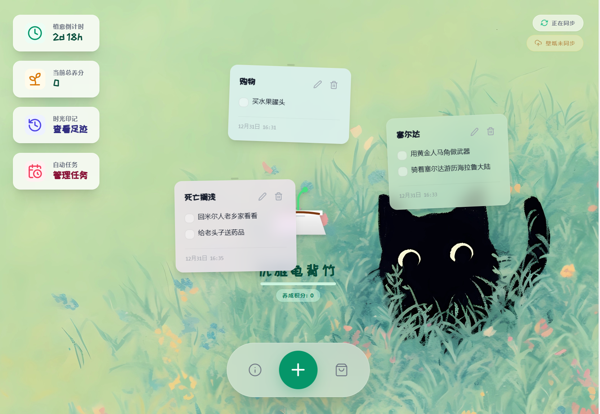
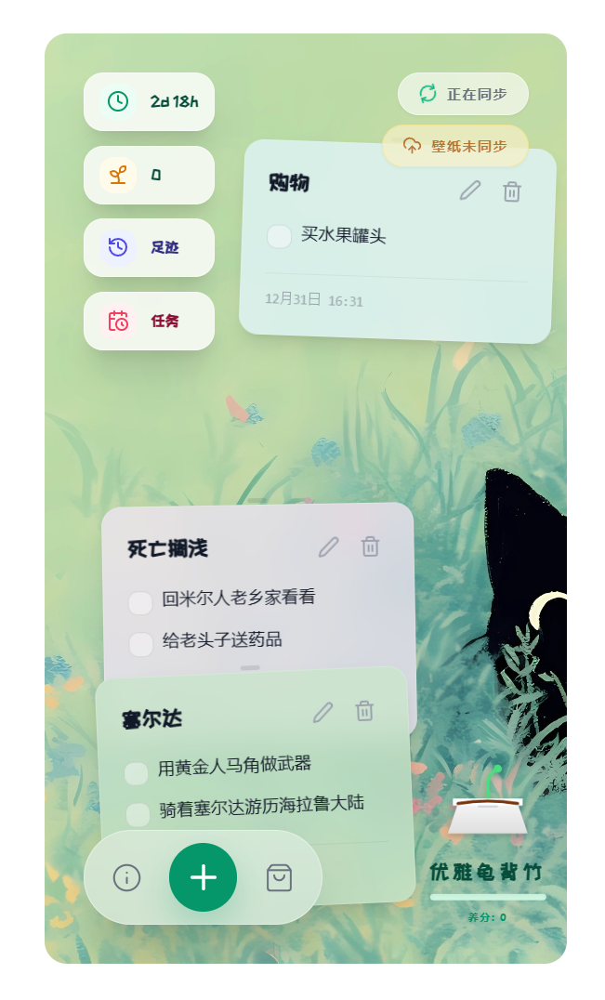
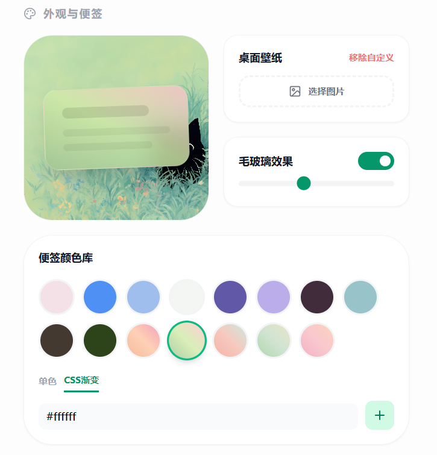

# 🌱 植语待办 (Plant Todo)

一个将待办事项与植物养护相结合的创意应用，通过完成任务来养护虚拟植物，让生产力变得有趣而治愈。

##  效果预览

### 网页端



### 移动端



## ✨ 核心特性

### 🌿 植物养护机制
- **生命倒计时**: 每株植物有3天初始生存时间，需要完成任务来延长生命
- **养分系统**: 完成待办事项获得养分，用于领养新植物
- **植物成长**: 植物有多个成长阶段
- **植物商店**: 提供11种不同风格的植物供选择领养

### 📝 智能待办管理
- **便签式界面**: 可拖拽、调整层级的彩色便签
- **子任务系统**: 每个待办事项支持多个子任务
- **智能整理**: 一键整理桌面，防止便签重叠或超出屏幕
- **响应式设计**: 完美适配桌面端和移动端

### ☁️ 数据同步与安全
- **云端同步**: 自动将数据同步到后端服务器
- **离线模式**: 支持离线使用，网络恢复后自动同步
- **历史记录**: 完整记录所有已完成的任务
- **数据恢复**: 支持恢复出厂设置

### 🎨 个性化体验
- **毛玻璃效果**: 可调节透明度的毛玻璃便签
- **动态特效**: 雨、雪、樱花等多种屏幕特效
- **自定义壁纸**: 支持上传个性化桌面背景
- **主题颜色**: 多种便签颜色可选

## 🛠️ 技术栈

### 前端
- **框架**: React 19 + TypeScript
- **构建工具**: Vite 6
- **UI组件**: 原生CSS + Tailwind CSS (CDN)
- **图标库**: Lucide React
- **状态管理**: React Hooks + LocalStorage

### 后端
- **运行时**: Node.js + Express
- **文件上传**: Multer (支持最大20MB)
- **数据存储**: JSON文件系统
- **API设计**: RESTful风格

### 部署
- **容器化**: Docker + Docker Compose
- **Web服务器**: Nginx (反向代理)
- **网络配置**: 自定义Docker网络

## 📁 项目结构

```
plant-todo/
├── backend/                    # 后端服务
│   ├── Dockerfile             # 后端容器配置
│   ├── package.json           # 后端依赖
│   ├── server.js              # 后端主程序
│   └── data/                  # 数据存储目录
│       ├── *.json             # 应用数据
│       ├── recodes-*.json     # 历史记录
│       └── image-*            # 上传的图片
├── docker/                    # 部署配置
│   ├── docker-compose.yml     # 容器编排
│   └── nginx.conf             # Nginx配置
├── frontend/                  # 前端应用
│   ├── src/                   # 源代码
│   │   ├── components/        # React组件
│   │   │   ├── ParticleSystem.tsx  # 粒子系统
│   │   │   ├── PlantDisplay.tsx    # 植物展示
│   │   │   ├── ScreenEffects.tsx   # 屏幕特效
│   │   │   └── StickyNote.tsx      # 便签组件
│   │   ├── config.ts          # 应用配置
│   │   ├── constants.ts       # 常量定义
│   │   ├── types.ts           # TypeScript类型
│   │   ├── App.tsx            # 主应用组件
│   │   └── index.tsx          # 入口文件
│   ├── public/                # 静态资源
│   ├── index.html             # HTML模板
│   ├── package.json           # 前端依赖
│   ├── tsconfig.json          # TypeScript配置
│   └── vite.config.ts         # Vite配置
├── .gitignore                 # Git忽略文件
└── README.md                  # 项目说明
```

## 🚀 快速开始

### 环境要求
- Node.js 18+ 或 Docker 20+
- npm 或 yarn 包管理器

### 本地开发

#### 1. 启动后端服务
```bash
cd backend
npm install
node server.js
```
后端将在 `http://localhost:3000` 启动。

#### 2. 启动前端应用
```bash
cd frontend
npm install
npm run dev
```
前端将在 `http://localhost:3000` 启动（如果端口冲突在 `vite.config.ts` 中修改）。

#### 3. 访问应用
打开浏览器访问 `http://localhost:3000` 即可开始使用。


### 🚀 Docker 部署

#### 1. 构建前端产物

```bash
cd frontend
npm install
npm run build
```

* 生成静态文件在 `frontend/dist/` 下。
* `dist/` 下包含 `index.html`、`favicon.png` 和 `assets/`。

---

#### 2. 确认项目结构

```
plant-todo/
├── backend/
│   ├── Dockerfile
│   ├── package.json
│   ├── server.js
│   └── data/
├── docker-compose.yml
├── frontend    # 前端产物
│   ├── assets
│   │   └── index-BYrnnb_3.js
│   ├── favicon.png
│   └── index.html
├── nginx.conf
```

---

#### 3. 修改端口和地址（可选操作，如果端口3000没有被占用可以保持默认）

##### 前端端口（开发环境时更改）

编辑 `frontend/vite.config.ts`：

```ts
export default defineConfig({
  server: {
    port: 5173,  // 开发端口
  },
})
```

##### 后端端口

编辑 `backend/server.js`：

```js
const PORT = 3000; // 修改为需要的端口
app.listen(PORT, () => console.log(`API running on ${PORT}`))
```

##### Nginx 配置

编辑 `docker/nginx.conf`：

```nginx
location /api/ {
    proxy_pass http://backend:3000;  # 与 backend 端口一致
}
```

##### 前端请求后端地址

编辑 `frontend/src/config.ts`：

```ts
export const APP_CONFIG = {
  API_BASE_URL: 'http://localhost:3000',  // 对应后端实际端口
  SYNC_PATH: '/api/sync/default',
  HISTORY_PATH: '/api/sync/recodes/default',
  IMAGE_PATH: '/api/sync/image/default',
  RESET_PATH: '/api/sync/factory-reset',
  SYNC_INTERVAL: 15000,
  AUTO_SAVE_DELAY: 2000
};
```

---

#### 4. 构建 Docker 镜像并启动容器

确保在项目根目录：

```bash
# 构建后端镜像
docker-compose build backend

# 启动所有服务（前端 Nginx + 后端）
docker-compose up -d
```

* `docker-compose build backend` 会根据 `backend/Dockerfile` 重新编译后端镜像，确保修改端口或依赖生效。
* 前端挂载 `frontend/dist/` 到 Nginx 容器，无需重新构建前端镜像，只要 `dist/` 最新即可。

---

#### 5. 停止和清理容器

```bash
docker-compose down
```

---

#### 说明

1. **前端修改** → 重新 `npm run build`，然后 `docker-compose up -d` 更新 Nginx 容器挂载的 `dist/`。
2. **后端修改** → 必须 `docker-compose build backend` 重新编译镜像，否则端口或代码改动不会生效。
3. **端口修改** → 前端开发端口在 `vite.config.ts`，后端端口在 `server.js`，同时修改 Nginx `proxy_pass`。
4. **前端请求后端** → `frontend/src/config.ts` 中的 `API_BASE_URL` 必须与实际后端端口匹配。

## 🔧 配置说明

### 前端配置 (`frontend/src/config.ts`)
```typescript
export const APP_CONFIG = {
  API_BASE_URL: '', // 后端API地址
  SYNC_PATH: '/api/sync/default',
  HISTORY_PATH: '/api/sync/recodes/default',
  IMAGE_PATH: '/api/sync/image/default',
  RESET_PATH: '/api/sync/factory-reset',
  SYNC_INTERVAL: 15000, // 同步间隔(毫秒)
  AUTO_SAVE_DELAY: 2000  // 自动保存延迟
};
```

### 后端配置
- **端口**: 3000 (可在 `server.js` 中修改)
- **图片文件大小限制**: 20MB (可在 `server.js` 中调整)
- **数据存储**: `backend/data/` 目录

### Nginx配置 (`docker/nginx.conf`)
- **前端端口**: 80 (容器内) → 12001 (宿主机)
- **API代理**: `/api/*` 转发到后端服务
- **文件上传**: 支持最大20MB文件

## 📡 API接口

### 数据同步
- `GET /api/sync/:id` - 获取应用数据
- `POST /api/sync/:id` - 保存应用数据

### 历史记录
- `GET /api/sync/recodes/:id` - 获取历史记录
- `POST /api/sync/recodes/:id` - 添加历史记录

### 图片管理
- `GET /api/sync/image/:id` - 获取上传的图片
- `POST /api/sync/image/:id` - 上传图片 (multipart/form-data)

### 系统管理
- `POST /api/sync/factory-reset` - 恢复出厂设置

## 🌱 植物系统

### 可用植物列表
1. **优雅龟背竹** - 具有独特艺术感的叶片
2. **浪漫薰衣草** - 淡雅的紫色芬芳
3. **优雅红玫瑰** - 热烈而高贵
4. **梦幻早樱** - 如云霞般绚烂
5. **气质郁金香** - 简约而不失格调
6. **热带棕榈** - 夏日的微风与摇曳的影
7. **深秋红枫** - 层林尽染的壮丽
8. **垂丝绿柳** - 依依惜别的柔情
9. **萌萌仙人掌** - 坚韧、圆润
10. **活力向日葵** - 永远追随光的方向
11. **古风小松** - 岁月的沉淀与自然的剪影

### 成长机制
- **养分获取**: 每个待办事项 = 1点养分
- **生存时间**: 1点养分 = 5天额外生存时间
- **领养成本**: 新植物需要300点养分
- **成长阶段**: 根据养护时间自动升级

## 🎯 使用指南

### 基本操作
1. **添加待办**: 点击右下角"+"按钮创建新便签
2. **完成任务**: 勾选子任务，点击"转换"按钮获得养分
3. **养护植物**: 养分自动用于延长植物生命
4. **领养新植物**: 积累足够养分后可在商店领养

### 高级功能
1. **桌面整理**: 在设置中点击"一键整理并同步"
2. **特效切换**: 在设置中选择雨、雪、樱花等特效
3. **壁纸更换**: 上传自定义图片作为桌面背景
4. **历史查看**: 查看所有已完成任务的记录

## 📰 News

### 2025/12/31

#### 🐞 修复

* 修复创建待办时未添加子任务也可提交，导致待办无法正常完成的问题。
* 修复已创建待办无法编辑的问题，并在便签右上角新增「编辑」入口。

#### 🎨 调整

* 字体更换为手写风格（偏可爱）。
* 放大网页端右上角功能组的按钮及文字尺寸。
* 优化「足迹」面板在移动端的展示效果。

#### ✨ 新增

* 新增 **自动待办**：支持自动创建周期性待办事项。
* 新增 **便签颜色管理**。

  * 与毛玻璃效果设置合并。
  * 支持实时预览便签效果。
  * **注：** 当前不支持调整 CSS 渐变的毛玻璃效果。

  

##### 渐变样式示例

**100% 不透明度：**

```
linear-gradient(to top right, #f2a883, #fdc5a3, #f28ca7)
linear-gradient(to top right, #9dc390, #d0eaa8, #ffc3cc)
linear-gradient(to top right, #f2a191, #f4bbae, #c0e2d6)
linear-gradient(to top right, #9bcc9a, #c4ddc5, #e2dcbb)
linear-gradient(to top right, #efa0b1, #f7bac3, #fac9aa)
```

**80% 不透明度：**

```
linear-gradient(to top right, rgba(242,168,131,0.8), rgba(253,197,163,0.8), rgba(242,140,167,0.8))
linear-gradient(to top right, rgba(157,195,144,0.8), rgba(208,234,168,0.8), rgba(255,195,204,0.8))
linear-gradient(to top right, rgba(242,161,145,0.8), rgba(244,187,174,0.8), rgba(192,226,214,0.8))
linear-gradient(to top right, rgba(155,204,154,0.8), rgba(196,221,197,0.8), rgba(226,220,187,0.8))
linear-gradient(to top right, rgba(239,160,177,0.8), rgba(247,186,195,0.8), rgba(250,201,170,0.8))
```

## 📄 许可证

> 未经作者授权，禁止将本项目用于商业用途。

